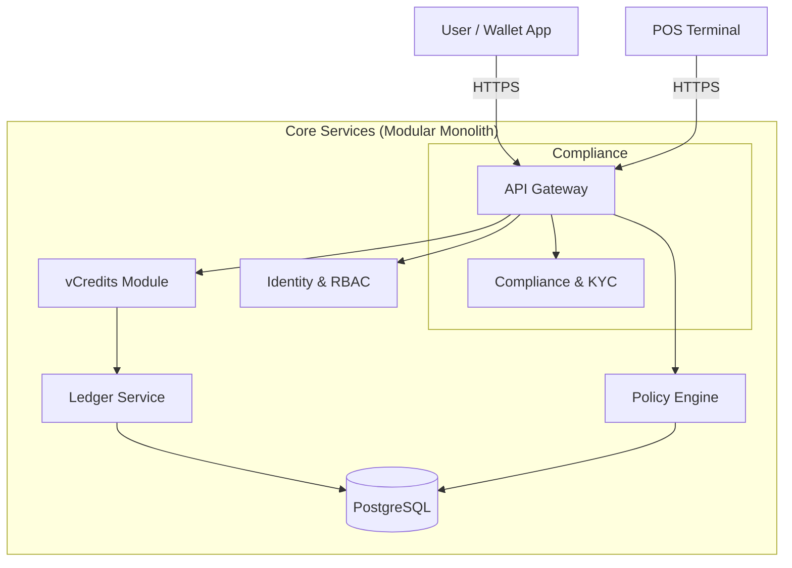

# Value OS

> A programmable financial operating system for the interoperable value layer.

## System Architecture

**Value OS** is a strict Modular Monolith. All financial movements are deterministic and recorded in an immutable double-entry ledger.

### Diagram

### Key Modules

1.  **vCredits**: Manages definitions of assets (Miles, Points) and high-level operations (Mint, Transfer).
2.  **Policy Engine**: The "Brain". Intercepts every transaction *before* it hits the ledger. Enforces limits, KYC checks, and fees.
3.  **Ledger**: The "Heart". A dumb, strict implementation of double-entry bookkeeping. `Credits = Debits`.
4.  **Compliance**: Stores attestations (e.g., "User X is over 18", "User Y passed Screen Z").

## Blockchain Integration Schema ($VAL)
*Planned for Q4 Phase.*

Currently, the `Ledger` service is the source of truth.
**Migration Path:**
1.  **State Anchoring**: Hash the Ledger state every hour and post to Ethereum L1 (Validation).
2.  **Tokenization**: Mirror `vCreditDefinition` to ERC-20 (or ERC-1155) contracts.
3.  **Settlement**:
    - Users "Bridge" internal vCredits to on-chain tokens.
    - `LedgerService` burns internal balance and mints on-chain token.
    - Policy Engine must be ported to Smart Contract logic or used as a centralized signer (Proof of Authority).

## Developer Setup

### Backend
\`\`\`bash
cd backend
npm install
# Create .env with DATABASE_URL
npx prisma db push
npm start
\`\`\`

### Frontend
\`\`\`bash
cd frontend
npm install
npm run dev
\`\`\`
